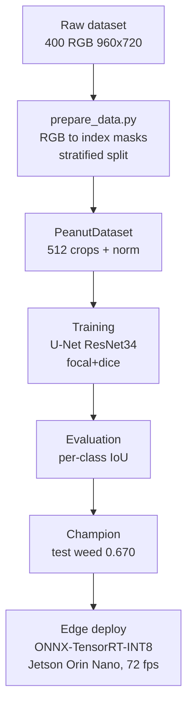
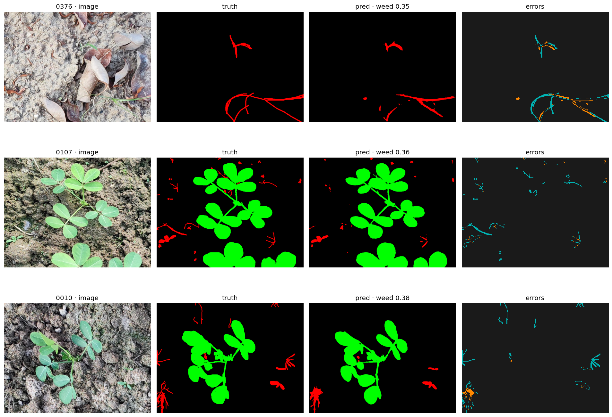
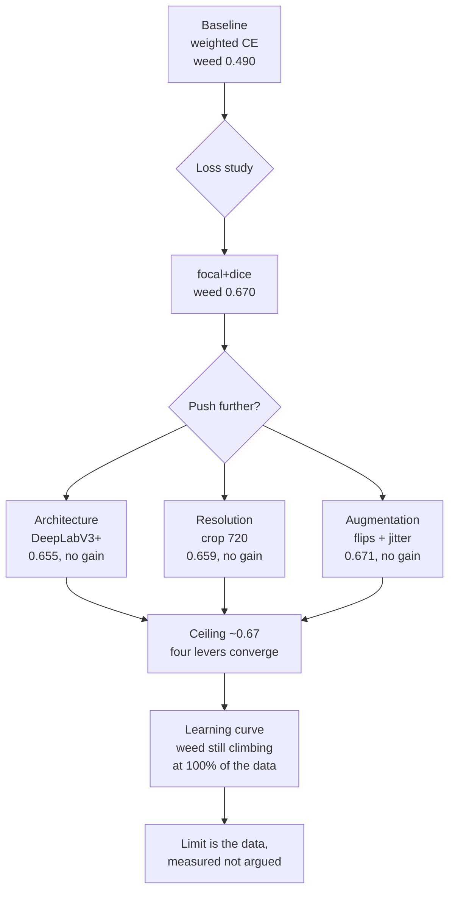

# cropweed-seg

Semantic segmentation of crop vs weed in peanut fields, built end to end: from
raw data to a deployable edge model. The project covers data exploration,
reproducible preprocessing, a measured loss-function study, honest per-class
evaluation, and edge deployment on Jetson.

**Headline result:** weed IoU 0.670, mIoU 0.850 on the held-out test set, with a
U-Net trained on a 3.7%-weed dataset, running at 72 fps INT8 on a Jetson Orin
Nano. weed is the hard class, and the accuracy is competitive with what
published work reports on the same dataset.

## Pipeline



## The problem

Peanut yields drop sharply when weeds compete during the early growth phase, so
detecting weed against crop and soil is a real precision-agriculture task. The
hard part is imbalance: in this dataset weed is 3.7% of pixels, crop 12.3%, and
background 84%. A model can score well on average while missing weed almost
entirely, so the imbalance shapes every decision here, from the loss to the
evaluation metric.

## Data

The [peanut dataset](https://github.com/ptdkhoa/Peanut-dataset) (Tran & Phan,
IEEE Access 2023, CC BY-SA 4.0) is 400 RGB images at 960x720 from fields near Da
Nang, Vietnam. Notebook 01 validates it end to end. Key findings:

- Masks contain exactly three clean colors across all 276M pixels. No
  antialiasing, no ambiguous pixels. Conversion to index masks is lossless.
- Class balance: background 84.0%, crop 12.3%, weed 3.7%.
- weed appears in every image; crop is absent from 29.5% of them. The split
  therefore stratifies by crop presence, not weed.

Splits are seeded and versioned so the experiments are reproducible.

## Method

- **Model:** U-Net with a ResNet34 encoder pretrained on ImageNet, via
  segmentation-models-pytorch. A standard, well-understood baseline rather than a
  hand-rolled architecture.
- **Training:** 512x512 random crops, full-frame evaluation, ImageNet
  normalization, batch 8, Adam at 1e-4, 25 epochs, seeded runs, checkpoint
  selection by best validation mIoU. Trained on Apple Silicon (MPS), roughly
  ten minutes per run.
- **Loss:** focal + Dice, chosen by a measured study (below).
- **Evaluation:** per-class IoU from a confusion matrix accumulated over the
  whole split, never aggregate mIoU alone. With 29.5% of images lacking crop,
  per-image IoU would be undefined for absent classes; accumulating sidesteps
  that.

## Results

### Loss study

Four imbalance-handling strategies, same split and seed handling, all run to
convergence at the same 25-epoch budget, reported at each run's best
validation mIoU epoch:

| loss | mIoU | weed IoU |
| --- | --- | --- |
| weighted cross-entropy | 0.768 | 0.490 |
| focal | 0.840 | 0.650 |
| dice | 0.844 | 0.660 |
| **focal + dice** | **0.849** | **0.670** |

focal+dice wins, reproducible across two seeds (weed 0.670 both times). The
improvement over the weighted cross-entropy baseline is +0.180 weed IoU. An
earlier 15-epoch version of this study ranked the losses differently: dice and
focal+dice had not converged at that budget, which is why every comparison
here is made at the plateau. Documented in the loss ADR.

### Test set

The champion, evaluated once on the held-out test split:

| class | IoU |
| --- | --- |
| background | 0.971 |
| crop | 0.910 |
| weed | 0.670 |
| **mIoU** | **0.850** |

Test matches validation almost exactly (weed 0.670 vs 0.670), so the estimate is
reliable and the method holds: stratified split, selection on validation, test
untouched until the end.

### Error analysis



The worst cases share a pattern: the model misses thin, filamentous,
low-contrast weed (teal in the error map), while segmenting compact weed and
crop well. Errors are dominated by false negatives on fine structures, not class
confusion. Per-image test weed IoU spans 0.355 to 0.855; the bottom of that
range is where the thin weed lives.

## The ceiling



weed converges around 0.67 across four independent levers: loss (the study
above), architecture (DeepLabV3+), input resolution (crop 720, the largest
square crop a 960x720 frame admits), and augmentation (flips plus mild color
jitter targeting the diagnosed photometric failure mode, run to convergence at
35 epochs). Four levers converging is strong evidence the limit is the task on
this dataset, not a single model choice. Because the augmented candidate never
beat the champion on validation, it never touched the test split.

The learning curve then measures the limit directly: retraining the champion
configuration on stratified, nested fractions of the train split at an equal
optimizer-step budget (~875 steps per run):

| fraction | images | weed IoU (val, best epoch) |
| --- | --- | --- |
| 25% | 70 | 0.621 |
| 50% | 140 | 0.639 |
| 75% | 210 | 0.648 |
| 100% | 280 | 0.670 |

Background stays flat across the curve and crop barely moves; the minority
class absorbs essentially all the benefit of more data, and the steepest
segment is the last one. At 100% of the data the slope is still positive: the
ceiling belongs to the data, not the model. One caveat: all images come from
one region and camera, so volume and diversity are partially confounded.

This reading matches the dataset authors and later work on the same data:

- PSPEdgeWeedNet (Pai et al., Sci Rep 2025) reports weed as the lowest-scoring
  class even with an edge-aware architecture and CRF post-processing, with weed
  around 0.60 to 0.69 depending on metric.
- The same work names the small, single-region dataset as a key limitation and
  notes these methods usually need thousands of images.
- The error mode they describe, missed small weed from lost spatial resolution,
  is the same one this project finds independently.

So weed 0.670 from a plain U-Net with focal+dice, no edge branch and no CRF, sits
in the competitive range for this dataset. The number is read as near the
practical ceiling, not as a weak result.

## Deployment

The champion is exported to ONNX, quantized to INT8, and deployed as TensorRT
engines on a Jetson Orin Nano Super. Each conversion step is verified before it
is trusted, the same principle as the lossless mask round-trip in notebook 01.

**ONNX export.** The PyTorch model exports to ONNX (fixed 1x3x720x960 input,
full-frame inference, opset 17). Fidelity is checked three ways: numerical
equivalence on a random input (max difference ~1e-5), exact prediction
agreement (100%), and matching per-class IoU on the test split (weed 0.670,
identical to PyTorch). The classic TorchScript exporter is used over the dynamo
exporter for maturity of the ONNX to TensorRT path.

**INT8 quantization (ONNX Runtime).** Static quantization (QDQ, MinMax
calibration from 50 train images, no val/test leak) cuts the model from 97.7 MB
to 24.6 MB, a 3.98x reduction. Per-class accuracy drop on test is essentially
zero:

| class | fp32 IoU | int8 IoU | drop |
| --- | --- | --- | --- |
| background | 0.9711 | 0.9710 | +0.0001 |
| crop | 0.9096 | 0.9095 | +0.0001 |
| weed | 0.6695 | 0.6696 | -0.0001 |
| mIoU | 0.8500 | 0.8500 | 0.0000 |

The hard class survives quantization without measurable loss. Three calibration
methods (MinMax, Entropy, Percentile) were compared on the same calibration set;
none improves on MinMax, which confirms the activations carry no problematic
outliers. Documented in the calibration ADR.

**TensorRT engines on device.** Both engines are built on the Jetson from the
fp32 ONNX. INT8 calibrates with TensorRT's entropy calibrator over the same 50
train images. Engine sizes follow the precision arithmetic: 97.7 MB fp32, 49.4
MB fp16, 25.1 MB int8.

**Latency benchmark.** Median and P95 over 500 timed inferences after 50 warmup
iterations, timing GPU inference only (copies and argmax outside the timed
region), one full 960x720 frame per inference:

| engine | size | median | P95 | throughput | weed IoU | mIoU |
| --- | --- | --- | --- | --- | --- | --- |
| FP16 | 49.4 MB | 22.38 ms | 22.40 ms | 44.7 fps | 0.6695 | 0.8500 |
| INT8 | 25.1 MB | 13.88 ms | 13.89 ms | 72.0 fps | 0.6689 | 0.8497 |

INT8 is 1.61x faster than FP16, and its weed IoU drop on device is 0.0006, noise
territory. Median and P95 sit 0.02 ms apart on both engines: with the board
state fixed, latency is stable enough that the tail collapses onto the typical
case. PyTorch, ONNX, and the on-device FP16 engine agree on test to four
decimals.

**Measurement environment.** Jetson Orin Nano Super 8GB, JetPack 6.2.1, TensorRT
10.3.0, nvpmodel MAXN_SUPER (mode 2), jetson_clocks active, cuda-python 12.x,
torch CPU for the data pipeline only. Raw results in `results/benchmark.json`.

## Scope decisions and future work

- **Experiment tracking** used versioned CSVs, not MLflow, given the small number
  of runs. A larger sweep would justify a tracking framework.
- **No further model tuning.** Four refuted levers plus a still-climbing
  learning curve say the remaining model-side ideas have diminishing returns.
- **Cross-dataset generalization (Bonn sugar beets)** is open as future work,
  and is now the sharpest version of "more data": the learning curve says
  volume helps, and a second region attacks the diversity confound too. It
  needs label-scheme and spectral remapping first.
- **Edge-guided segmentation** (a boundary loss or edge branch) could target the
  fine-structure errors, but faces the same data ceiling.
- **TensorRT 10.3 vs newer releases.** The engines were built and measured on
  JetPack 6.2.1. Rebuilding on a newer JetPack would isolate how much the stack
  alone improves latency, with no model changes.

## Reproducibility

Requires [uv](https://docs.astral.sh/uv/).

```bash
git clone git@github.com:alexmnz29/cropweed-seg.git
cd cropweed-seg
uv sync
```

Download the [peanut dataset](https://github.com/ptdkhoa/Peanut-dataset) into
`data/raw/{images,labels}/`, then:

```bash
uv run scripts/prepare_data.py          # verify, convert masks, write splits
uv run scripts/train.py                 # train (config in the script header)
uv run scripts/evaluate.py --run focal_dice_s42 --split test
uv run pytest                           # run the test suite
```

The learning curve reproduces with `uv run scripts/make_learning_curve_splits.py`
followed by training runs at each fraction (epoch counts per fraction in the
learning-curve ADR). Article figures regenerate with
`uv run scripts/make_figures.py`.

Jetson deployment (build engines and benchmark on the device) is documented in
`docs/deployment_runbook.md`.

Each training run writes its config, checkpoint, and per-epoch metrics to
`runs/<name>/`. Decisions are documented in `docs/decisions/`.
