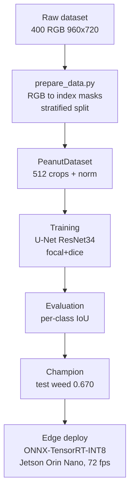
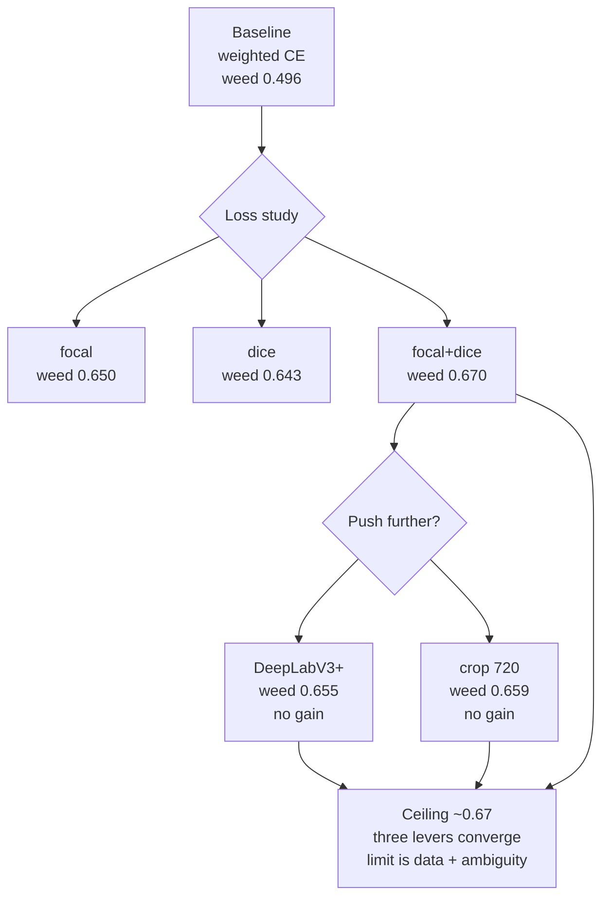

# cropweed-seg

Semantic segmentation of crop vs weed in peanut fields, built end to end: from
raw data to a deployable edge model. The project covers data exploration,
reproducible preprocessing, a measured loss-function study, honest per-class
evaluation, and edge deployment on Jetson.

**Headline result:** weed IoU 0.670, mIoU 0.850 on the held-out test set, with a
U-Net trained on a 3.7%-weed dataset, running at 72 fps INT8 on a Jetson Orin
Nano. weed is the hard class, and the accuracy is competitive with what
published work reports on the same dataset.

## Pipeline



## The problem

Peanut yields drop sharply when weeds compete during the early growth phase, so
detecting weed against crop and soil is a real precision-agriculture task. The
hard part is imbalance: in this dataset weed is 3.7% of pixels, crop 12.3%, and
background 84%. A model can score well on average while missing weed almost
entirely, so the imbalance shapes every decision here, from the loss to the
evaluation metric.

## Data

The [peanut dataset](https://github.com/ptdkhoa/Peanut-dataset) (Tran & Phan,
IEEE Access 2023, CC BY-SA 4.0) is 400 RGB images at 960x720 from fields near Da
Nang, Vietnam. Notebook 01 validates it end to end. Key findings:

- Masks contain exactly three clean colors across all 276M pixels. No
  antialiasing, no ambiguous pixels. Conversion to index masks is lossless.
- Class balance: background 84.0%, crop 12.3%, weed 3.7%.
- weed appears in every image; crop is absent from 29.5% of them. The split
  therefore stratifies by crop presence, not weed.

Splits are seeded and versioned so the experiments are reproducible.

## Method

- **Model:** U-Net with a ResNet34 encoder pretrained on ImageNet, via
  segmentation-models-pytorch. A standard, well-understood baseline rather than a
  hand-rolled architecture.
- **Training:** 512x512 random crops at native resolution, full-frame evaluation,
  ImageNet normalization, Adam, seeded runs.
- **Loss:** focal + Dice, chosen by a measured study (below).
- **Evaluation:** per-class IoU from a confusion matrix accumulated over the
  whole split, never aggregate mIoU alone. With 29.5% of images lacking crop,
  per-image IoU would be undefined for absent classes; accumulating sidesteps
  that.

## Results

### Loss study

Four imbalance-handling strategies, all at the best mIoU epoch, same split and
seed handling. focal and focal+dice were run to convergence at 25 epochs.

| loss | mIoU | weed IoU |
| --- | --- | --- |
| weighted cross-entropy | 0.768 | 0.496 |
| focal | 0.840 | 0.650 |
| dice | 0.838 | 0.643 |
| **focal + dice** | **0.849** | **0.670** |

focal+dice wins, reproducible across two seeds (weed 0.670 both times). The
improvement over the weighted cross-entropy baseline is +0.174 weed IoU.

### Test set

The champion, evaluated once on the held-out test split:

| class | IoU |
| --- | --- |
| background | 0.971 |
| crop | 0.910 |
| weed | 0.670 |
| **mIoU** | **0.850** |

Test matches validation almost exactly (weed 0.670 vs 0.670), so the estimate is
reliable and the method holds: stratified split, selection on validation, test
untouched until the end.

### Error analysis


The worst cases share a pattern: the model misses thin, filamentous,
low-contrast weed (teal in the error map), while segmenting compact weed and
crop well. Errors are dominated by false negatives on fine structures, not class
confusion.

## The ceiling



weed converges around 0.67 across three independent levers: loss (the study
above), architecture (DeepLabV3+, no improvement), and input resolution (720
crops, no improvement). Three levers converging is strong evidence the limit is
the task on this dataset, not a single model choice.

The likely cause is intrinsic ambiguity plus data size. Thin low-contrast stems
are genuinely hard to separate, and 400 images give few examples to learn from.
This reading matches the dataset authors and later work on the same data:

- PSPEdgeWeedNet (Pai et al., Sci Rep 2025) reports weed as the lowest-scoring
  class even with an edge-aware architecture and CRF post-processing, with weed
  around 0.60 to 0.69 depending on metric.
- The same work names the small, single-region dataset as a key limitation and
  notes these methods usually need thousands of images.
- The error mode they describe, missed small weed from lost spatial resolution,
  is the same one this project finds independently.

So weed 0.670 from a plain U-Net with focal+dice, no edge branch and no CRF, sits
in the competitive range for this dataset. The number is read as near the
practical ceiling, not as a weak result.

## Deployment

The champion is exported to ONNX, quantized to INT8, and deployed as TensorRT
engines on a Jetson Orin Nano Super. Each conversion step is verified before it
is trusted, the same principle as the lossless mask round-trip in notebook 01.

**ONNX export.** The PyTorch model exports to ONNX (fixed 1x3x720x960 input,
full-frame inference). Fidelity is checked three ways: numerical equivalence on a
random input (max difference ~1e-5), exact prediction agreement (100%), and
matching per-class IoU on the test split (weed 0.670, identical to PyTorch). The
classic TorchScript exporter is used over the dynamo exporter for maturity of the
ONNX to TensorRT path.

**INT8 quantization (ONNX Runtime).** Static quantization (QDQ, MinMax
calibration from 50 train images, no val/test leak) cuts the model from 97.7 MB
to 24.6 MB, a 3.98x reduction. Per-class accuracy drop on test is essentially
zero:

| class | fp32 IoU | int8 IoU | drop |
| --- | --- | --- | --- |
| background | 0.9711 | 0.9710 | +0.0001 |
| crop | 0.9096 | 0.9095 | +0.0001 |
| weed | 0.6695 | 0.6696 | -0.0001 |
| mIoU | 0.8500 | 0.8500 | 0.0000 |

The hard class survives quantization without measurable loss. Three calibration
methods (MinMax, Entropy, Percentile) were compared on the same calibration set;
none improves on MinMax, which confirms the activations carry no problematic
outliers. Documented in the calibration ADR.

**TensorRT engines on device.** Both engines are built on the Jetson from the
fp32 ONNX. INT8 calibrates with TensorRT's entropy calibrator over the same 50
train images. Engine sizes follow the precision arithmetic: 97.7 MB fp32, 49.4
MB fp16, 25.1 MB int8.

**Latency benchmark.** Median and P95 over 500 timed inferences after 50 warmup
iterations, timing GPU inference only (copies and argmax outside the timed
region), one full 960x720 frame per inference:

| engine | size | median | P95 | throughput | weed IoU | mIoU |
| --- | --- | --- | --- | --- | --- | --- |
| FP16 | 49.4 MB | 22.38 ms | 22.40 ms | 44.7 fps | 0.6695 | 0.8500 |
| INT8 | 25.1 MB | 13.88 ms | 13.89 ms | 72.0 fps | 0.6689 | 0.8497 |

INT8 is 1.61x faster than FP16, and its weed IoU drop on device is 0.0006, noise
territory. Median and P95 sit 0.02 ms apart on both engines: with the board
state fixed, latency is stable enough that the tail collapses onto the typical
case. PyTorch, ONNX, and the on-device FP16 engine agree on test to four
decimals.

**Measurement environment.** Jetson Orin Nano Super 8GB, JetPack 6.2, TensorRT
10.3.0, nvpmodel MAXN_SUPER (mode 2), jetson_clocks active, cuda-python 12.x,
torch CPU for the data pipeline only. Raw results in `results/benchmark.json`.

## Scope decisions and future work

- **Experiment tracking** used versioned CSVs, not MLflow, given the small number
  of runs. A larger sweep would justify a tracking framework.
- **No further model tuning.** Three levers showed the ceiling; more backbones or
  losses have diminishing returns.
- **Cross-dataset generalization (Bonn sugar beets)** is open as future work. It
  needs label-scheme and spectral remapping, and a weed-only framing would
  isolate generalization from class mismatch.
- **Edge-guided segmentation** (a boundary loss or edge branch) could target the
  fine-structure errors, but faces the same data ceiling.
- **TensorRT 10.3 vs newer releases.** The engines were built and measured on
  JetPack 6.2. Rebuilding on a newer JetPack would isolate how much the stack
  alone improves latency, with no model changes.

## Reproducibility

Requires [uv](https://docs.astral.sh/uv/).

```bash
git clone git@github.com:alexmnz29/cropweed-seg.git
cd cropweed-seg
uv sync
```

Download the [peanut dataset](https://github.com/ptdkhoa/Peanut-dataset) into
`data/raw/{images,labels}/`, then:

```bash
uv run scripts/prepare_data.py          # verify, convert masks, write splits
uv run scripts/train.py                 # train (config in the script header)
uv run scripts/evaluate.py --run focal_dice_s42 --split test
uv run pytest                           # run the test suite
```

Jetson deployment (build engines and benchmark on the device) is documented in
`docs/deployment_runbook.md`.

Each training run writes its config, checkpoint, and per-epoch metrics to
`runs/<name>/`. Decisions are documented in `docs/decisions/`.
